<!--
  README de perfil de Brandon Eden Visoso
  Antes de publicar: reemplaza TU_USUARIO por tu usuario de GitHub
  y NOMBRE_REPO por el nombre real de cada repositorio.
-->

<p align="center">
  
</p>

<p align="center">
  <a href="https://www.linkedin.com/in/brandonvisoso/"></a>
  <a href="mailto:brandonvisoso482@gmail.com"></a>
  <!-- Cuando subas tu CV a assets/, activa esta línea:
  <a href="./assets/CV_Brandon_Visoso.pdf"></a>
  -->
</p>

<p align="center">
  <sub>Disponible para puestos de backend o full stack junior y para proyectos freelance. México.</sub>
</p>

<br/>

## Sobre mí

Soy ingeniero en sistemas computacionales y me especializo en backend: diseño microservicios con Java y Spring, desde el registro de servicios y el API Gateway hasta la comunicación entre servicios y el manejo de fallas. Cuando el proyecto lo pide, también construyo el frontend en Angular.

Me importa que el código funcione, pero también que se entienda y esté probado. Separo responsabilidades por capas, valido los datos en cada servicio y escribo pruebas unitarias. Desde 2024 trabajo como desarrollador freelance a través de Workana, y en 2026 terminé la carrera y una capacitación en microservicios con Java y Spring en ENUCOM.

```java
record Developer(String rol, String formacion,
                 List<String> enfoque, String modalidad) {}

var brandon = new Developer(
    "Desarrollador backend",
    "Ing. en Sistemas Computacionales (2026)",
    List.of("Microservicios", "APIs REST", "Pruebas unitarias"),
    "Freelance desde 2024"
);
```

<br/>

## Stack

<table>
  <tr>
    <td valign="top"><b>Backend</b></td>
    <td>
      &nbsp;
      &nbsp;
      
      <br/><sub>Java, Spring Boot, Spring Cloud (Eureka, Gateway, OpenFeign, Circuit Breaker), APIs REST, Maven</sub>
    </td>
  </tr>
  <tr>
    <td valign="top"><b>Frontend</b></td>
    <td>
      &nbsp;
      &nbsp;
      &nbsp;
      &nbsp;
      
      <br/><sub>Angular, TypeScript, HTML, CSS, JavaScript</sub>
    </td>
  </tr>
  <tr>
    <td valign="top"><b>Bases de datos</b></td>
    <td>
      &nbsp;
      
      <br/><sub>PostgreSQL, Oracle 21c, MySQL, SQL</sub>
    </td>
  </tr>
  <tr>
    <td valign="top"><b>Pruebas y APIs</b></td>
    <td>
      &nbsp;
      &nbsp;
      
      <br/><sub>JUnit 5, Mockito, JaCoCo, Swagger / OpenAPI, Postman</sub>
    </td>
  </tr>
  <tr>
    <td valign="top"><b>Herramientas</b></td>
    <td>
      &nbsp;
      &nbsp;
      &nbsp;
      &nbsp;
      
      <br/><sub>Git, IntelliJ IDEA, VS Code, Linux, Windows, Scrum</sub>
    </td>
  </tr>
  <tr>
    <td valign="top"><b>También</b></td>
    <td>
      
      <br/><sub>Python</sub>
    </td>
  </tr>
</table>

<br/>

## Proyectos

<table>
  <tr>
    <td colspan="2" valign="top">
      <h3>EdeBook</h3>
      <p>
        Sistema para administrar bibliotecas construido con microservicios. Bibliotecas, autores, libros y usuarios
        son servicios independientes que se registran en Eureka y se exponen a través de un API Gateway.
        Se comunican con OpenFeign y RestTemplate con balanceo de carga, y el servicio de libros usa
        Circuit Breaker para seguir respondiendo cuando falla un servicio del que depende.
        El frontend en Angular tiene un panel de administración con vistas según el rol y un catálogo público.
      </p>
      <p>
        <b>68 pruebas unitarias</b> con JUnit 5 y Mockito, <b>97.4 % de cobertura</b> medida con JaCoCo
        y cada API documentada con Swagger.
      </p>
      <p>
        <code>Java</code> <code>Spring Boot</code> <code>Spring Cloud</code> <code>OpenFeign</code>
        <code>Angular</code> <code>Oracle</code> <code>PostgreSQL</code> <code>JUnit 5</code>
      </p>
      <a href="https://github.com/TU_USUARIO/NOMBRE_REPO"><b>Ver repositorio</b></a>
    </td>
  </tr>
  <tr>
    <td width="50%" valign="top">
      <h3>Clínica veterinaria</h3>
      <p><sub>En desarrollo</sub></p>
      <p>
        Microservicios para una veterinaria: veterinarias, clientes, responsables y mascotas.
        Cada servicio tiene su propia base de datos, Oracle o PostgreSQL, y las relaciones entre ellos
        se validan con llamadas HTTP antes de guardar, sin llaves foráneas entre bases.
      </p>
      <p>
        <code>Spring Boot</code> <code>Spring Cloud</code> <code>OpenFeign</code>
        <code>RestTemplate</code> <code>Oracle</code> <code>PostgreSQL</code> <code>Angular</code>
      </p>
      <a href="https://github.com/TU_USUARIO/NOMBRE_REPO"><b>Ver repositorio</b></a>
    </td>
    <td width="50%" valign="top">
      <h3>Gestión de personal</h3>
      <p><sub>Backend funcional</sub></p>
      <p>
        Tres microservicios para empleados, departamentos y puestos, cada uno con su propia base
        PostgreSQL y registrado en Eureka. Arquitectura por capas (entidad, DAO, servicio y controlador)
        con validación de registros duplicados.
      </p>
      <p>
        <code>Java</code> <code>Spring Boot</code> <code>Eureka</code>
        <code>PostgreSQL</code> <code>Postman</code>
      </p>
      <a href="https://github.com/TU_USUARIO/NOMBRE_REPO"><b>Ver repositorio</b></a>
    </td>
  </tr>
</table>

<br/>

## Actividad en GitHub

<p align="center">
  
  
</p>

<p align="center"><sub>Tarjetas generadas cada día con GitHub Actions.</sub></p>

<br/>

## Ahora mismo

- **Construyendo** autenticación con JWT y roles para EdeBook: un servicio propio emite los tokens y el Gateway los valida en cada petición. También avanzo con el sistema de la clínica veterinaria.
- **Aprendiendo** Spring Security y signals de Angular.
<!-- - **Explorando** escribe aquí la tecnología que estés explorando -->

<br/>

## Contacto

Si buscas a alguien para un equipo de backend o tienes un proyecto en mente, escríbeme.

<p>
  <a href="https://www.linkedin.com/in/brandonvisoso/"></a>
  <a href="mailto:brandonvisoso482@gmail.com"></a>
  <a href="https://wa.me/525510984117"></a>
  <!-- Activa estas líneas cuando tengas los enlaces:
  <a href="URL_DE_TU_PERFIL_EN_WORKANA"></a>
  <a href="URL_DE_TU_PORTAFOLIO"></a>
  -->
</p>

<br/>

<p align="center"><sub><i>El aprendizaje no termina con el título, apenas comienza.</i></sub></p>
